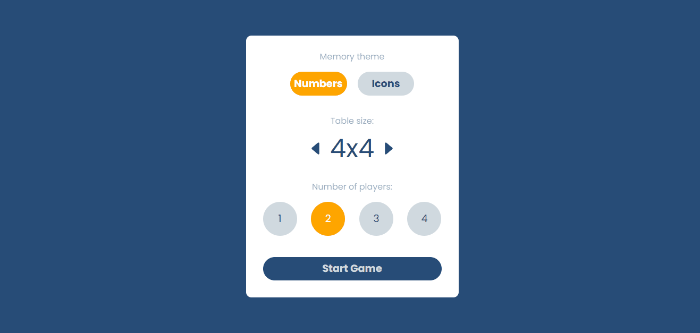
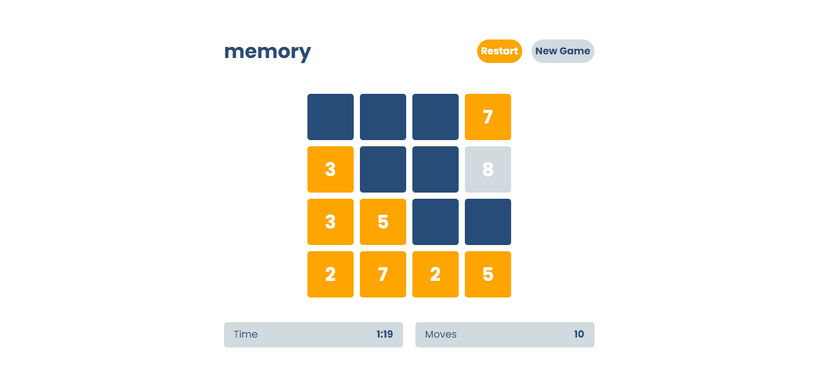
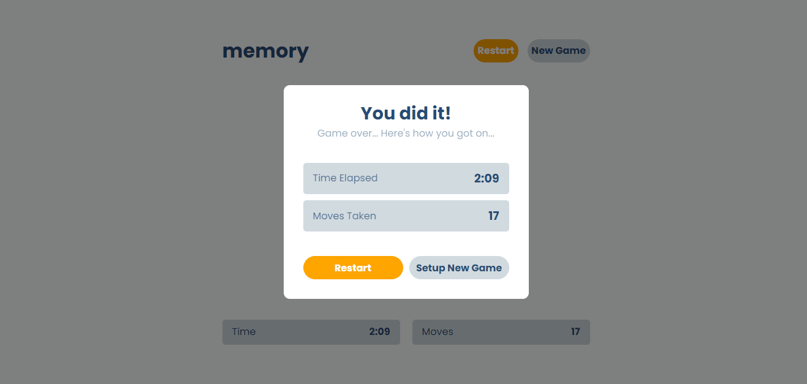
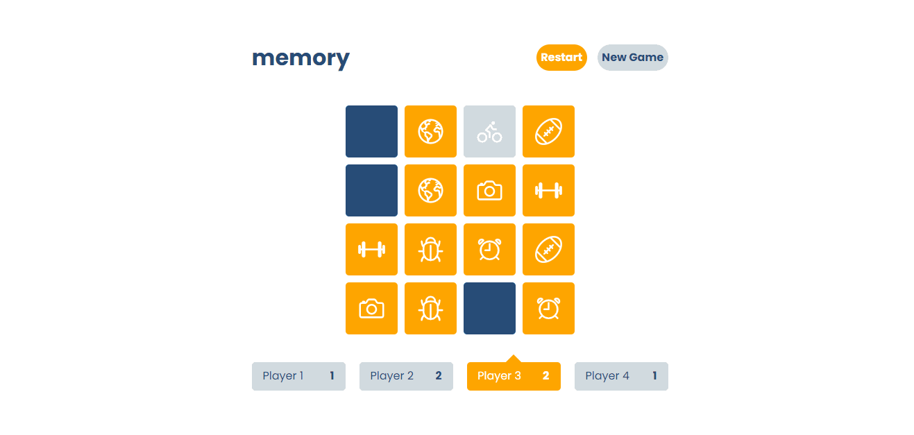
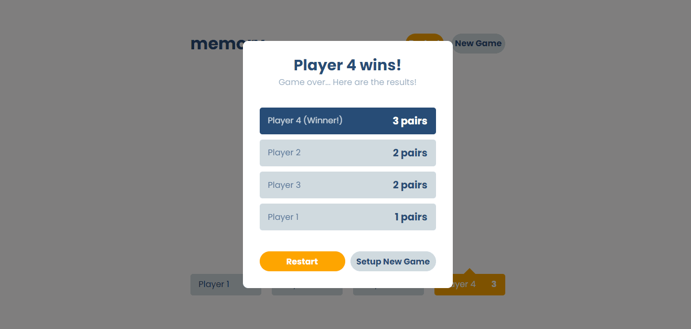

## :video_game: Demo

## :joystick: How to play

There are three main configs:

|Config|Options|
|:---:|:---:|
|Memory theme|`numbers` or `icons`|
|Table size|`2x2`, `4x4` or `6x6`|
|Number of players|`1 - 4`|

### :one: Solo mode

> Find all the pairs of cards in the shortest time possible.

    
&nbsp; &nbsp; &nbsp; &nbsp;
    

### :four: Multiplayer mode

> The one who misses the correct pair will pass the turn for the next player, until all pairs of cards are found.

    
&nbsp; &nbsp; &nbsp; &nbsp;
    

---

Made with 🤍 by Caique C.
